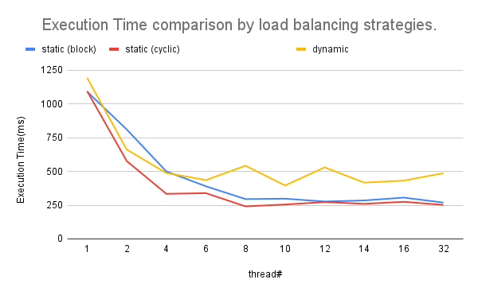
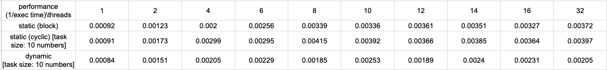
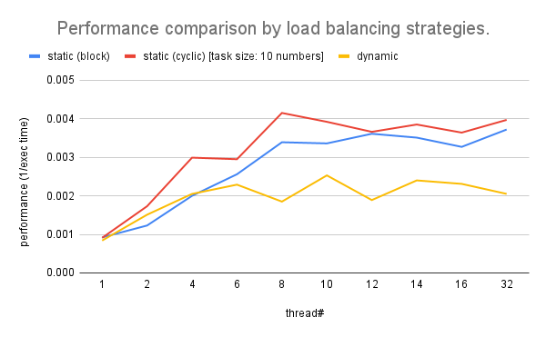
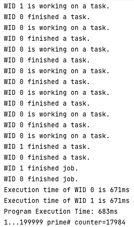

# 2023 - Spring, Multi Core Computing Assignment1, Problem1 Performance Report
20150736 음호준  
## Environment
### CPU Type
Apple M1 Pro(No Hyper Threading)
### Number of cores
8(6 for Performance, 2 for Efficiency)
### Clock Speed  
Not Revealed   
### Memory Size
16GB
### OS Type
mac os Ventura 13.3.1

## Tables and Graphs
### Execution Time for each threads
#### Table

#### Graph

### Performance for each threads
#### Table

#### Graph


## Explanation and Analysis of the results
I used 3 different approaches for load balancing, which are block decomposition, cyclic decomposition, and dynamic load balancing.
The task is counting how many prime numbers in between from 1 to 199999. Each approach divide task into multiple subtasks(more than 2)
in different ways.

1. Block Decomposition
Divide the numbers from 1 to 199999 into number of block according to the number of threads.  
For instance, if I have to use 4 threads, then divide the whole numbers into 4 blocks sequentially.  
Then, assign each block task to each thread.


2. Cyclic Decomposition
Divide the numbers from 1 to 199999 into number of subtasks in cyclic manner. The size of subtask is fixed to 10.  
Each thread takes subtask(which has size of 10) from 1 to 199999 sequentially.  
For instance, if I have to use 4 threads, then each thread numbered from 0 to 3 takes subtask as follows.
> {1...10} -> 0th thread, {11...20} -> 1st thread, {21...30} -> 2nd thread, {31...40} -> 3rd thread.  

Then, each thread performs its task individually.

3. Dynamic Load Balancing
Assign the numbers from 1 to 199999 into number of subtasks in dynamic manner. The size of subtask is fixed to 10.  
Each thread takes subtask(which has size of 10) from 1 to 199999 sequentially.
Dynamic manner means, the worker(thread) takes its subtask(work) dynamically when it finishes assigned work.  
For instance, if I have to use 4 threads, then each thread numbered from 0 to 3 takes subtask as follows.  
> At start, each thread takes subtask like cyclic decomposition(described above)  
> And let's say 2nd thread finishes its work first, then it takes subtask(which has size of 10) from remaining task(the numbers not checked)

The result of block and cyclic decomposition is quite similar.  
The Performance(1/execution time(ms)) is increase rapidly when the number of thread is small.

In case of block decomposition, 
As the number of thread increase, the rate of increase gets slow down.  
The highest performance shows when thread is 32(max).  
The reasonable analysis for this phenomenon seems that block decomposition assign subtasks to workers
completely pre-defined way and which results in computing with no overhead for each thread about assigning subtasks.

In case of cyclic decomposition,
The performance has peak when 8 threads are used(same as the number of cores).
Then it gets down until 12 threads, then gets high again until 32 threads.  
The reasonable analysis for this phenomenon seems that cyclic decomposition assign subtasks in somewhat partitioning 
manner(each subtask is composed of separated parts(which has size of 10)) and which results in having more computing 
overhead when using cores more than the computer system's maximum cores. As the cores are heterogeneous(6 for performance,
2 for efficiency), there would be challenges to utilize cores for performance. 

In case of dynamic decomposition,  
The performance didn't increase much as static decomposition.  
The performance grows slower than static load balancing methods from 1 thread to 32 threads.  
The reasonable analysis for this phenomenon seems that there were problem with efficient algorithm for 
dynamic load balancing. As the task goes by, we don't know which thread(worker) finishes earlier. Then, 
naturally the bad case of load balancing can occur. For example, if we use 4 threads, then 2nd and 3rd worker 
keep finishing work earlier than other workers, it takes more and more subtasks from the original task.
This case results in improper and inefficient load balancing(not well-balanced subtask size for each thread).  

In conclusion, 
We can see the tendency of increasing performance by the number of thread increasing, but there were 
also differences and challenges by approaches.  
I recognized the importance of proper dynamic load balancing strategy for performance, 
and thread management, scheduling strategy for performance.  
Although I can't know what thread management strategy is used for Apple M1 Pro processor, but 
I can surely know there are challenges for using more threads than cores. 

## Source Code
### Block Decomposition
```java
import java.util.concurrent.atomic.AtomicInteger;

public class pc_static_block {
    private static int NUM_END = 200000; // default input
    private static int NUM_THREADS = 1;
    // In static load balancing, we use block decomposition.
    // Which divide whole task into subtasks.
    // The size of subtasks are statically defined.
    // Which is calculated by (task size) / (number of workers(threads))
    public static void main(String[] args) {
        if (args.length == 2) {
            NUM_THREADS = Integer.parseInt(args[0]);
            NUM_END = Integer.parseInt(args[1]);
        }
        AtomicInteger counter = new AtomicInteger(0);
        int[] workloads = divideIntoSubtasks(NUM_END, NUM_THREADS);
        Thread[] workers = createWorkers(workloads, counter);
        long startTime = System.currentTimeMillis();
        for (Thread worker : workers) {
            worker.start();
        }
        try {
            for (Thread worker : workers) {
                worker.join();
            }
        } catch (InterruptedException e) {}
        long endTime = System.currentTimeMillis();
        long timeDiff = endTime - startTime;
        System.out.println("Program Execution Time: " + timeDiff + "ms");
        System.out.println("1..." + (NUM_END - 1) + " prime# counter=" + counter.get());
    }

    private static int[] divideIntoSubtasks(int num_end, int num_threads) {
        int[] workloads = new int[num_threads];
        for (int i = 0;i < num_threads;i++) {
            int partitionEnd = (num_end/num_threads) * (i+1);
            if (i == num_threads-1 && partitionEnd < num_end) {partitionEnd = num_end;}
            workloads[i] = partitionEnd;
        }
        return workloads;
    }

    private static Thread[] createWorkers(int[] subTasks, AtomicInteger counter) {
        int workStart = 1; int workEnd;
        Thread[] workers = new Thread[subTasks.length];
        for (int i=0;i<subTasks.length;i++) {
            if (i!=0) {workStart = subTasks[i-1]+1;}
            workEnd = subTasks[i];
            workers[i] = new PrimeCheckBlockWorker(i, workStart, workEnd, counter);
        }
        return workers;
    }

}

public class PrimeCheckBlockWorker extends Thread {
   final private AtomicInteger counter;
   final private int workStart;
   final private int workEnd;

   public PrimeCheckBlockWorker(int wid, int workStart, int workEnd, AtomicInteger counter) {
      super("WID "+wid);
      this.workStart = workStart;
      this.workEnd = workEnd;
      this.counter = counter;
   }

   public void run() {
      System.out.println(getName() + " is working.");
      for (int i = workStart; i < workEnd; i++) {
         if (isPrime(i)) counter.incrementAndGet();
      }
      System.out.println(getName() + " is done.");
   }
   private boolean isPrime(int x) {
      int i;
      if (x <= 1) return false;
      for (i = 2; i < x; i++) {
         if (x % i == 0) return false;
      }
      return true;
   }
}
```

### Cyclic Decomposition
```java
import java.util.concurrent.atomic.AtomicInteger;

public class pc_static_cyclic {
    private static int NUM_END = 200000; // default input
    private static int NUM_THREADS = 1;
    private static final int TASK_SIZE = 10;
    // In static load balancing, we use cyclic decomposition.
    // Which divide whole task into subtasks in cyclic way.
    // The size of subtasks are statically defined.
    // And the subtasks are assigned to each thread in cyclic way.
    public static void main(String[] args) {
        if (args.length == 2) {
            NUM_THREADS = Integer.parseInt(args[0]);
            NUM_END = Integer.parseInt(args[1]);
        }
        AtomicInteger counter = new AtomicInteger(0);
        Thread[] workers = assignSubTasks(NUM_END, NUM_THREADS, counter);
        long startTime = System.currentTimeMillis();
        for (Thread worker : workers) {worker.start();}
        try {
            for (Thread worker : workers) {worker.join();}
        } catch (InterruptedException e) {}
        long endTime = System.currentTimeMillis();
        long timeDiff = endTime - startTime;
        System.out.println("Program Execution Time: " + timeDiff + "ms");
        System.out.println("1..." + (NUM_END - 1) + " prime# counter=" + counter.get());
    }

    private static Thread[] assignSubTasks(int num_end, int num_threads, AtomicInteger counter) {
        Thread[] workers = new Thread[num_threads];
        int stride = TASK_SIZE * num_threads;
        for (int i=0;i<num_threads;i++) {
            workers[i] = new PrimeCheckCyclicWorker(i,stride,TASK_SIZE,num_end,counter);
        }
        return workers;
    }
}

public class PrimeCheckCyclicWorker extends Thread {
   final int wid;
   final int stride; final int taskSize; final int numEnd;
   final AtomicInteger counter;
   public PrimeCheckCyclicWorker(int wid, int stride, int taskSize, int numEnd, AtomicInteger counter) {
      super("WID "+wid);
      this.wid = wid;
      this.stride = stride;
      this.taskSize = taskSize;
      this.numEnd = numEnd;
      this.counter = counter;
   }

   public void run() {
      int base = 1; int cycleEnd = Math.floorDiv(numEnd,stride);
      int taskStart; int taskEnd; int threads = stride / taskSize;
      System.out.println(getName()+" is working.");
      for (int i=0;i<cycleEnd;i++) {
         taskStart = base + taskSize * wid;
         taskEnd = taskStart + taskSize;
         if (i == cycleEnd-1 && wid == threads-1) {taskEnd = numEnd;}
         for (int j=taskStart;j<taskEnd;j++) {
            if (isPrime(j)) {counter.incrementAndGet();}
         }
         base += stride;
      }
      System.out.println(getName()+" is done.");
   }
   private boolean isPrime(int x) {
      int i;
      if (x <= 1) return false;
      for (i = 2; i < x; i++) {
         if (x % i == 0) return false;
      }
      return true;
   }
}
```

### Dynamic Load Balancing
```java
import java.util.concurrent.atomic.AtomicInteger;

public class pc_dynamic {
    private static int NUM_END = 200000; // default input
    private static int NUM_THREADS = 1;
    private static final int TASK_SIZE = 10;
    public static void main(String[] args) {
        if (args.length == 2) {
            NUM_THREADS = Integer.parseInt(args[0]);
            NUM_END = Integer.parseInt(args[1]);
        }
        AtomicInteger counter = new AtomicInteger(0);
        long startTime = System.currentTimeMillis();
        checkPrimeNumberDynamically(NUM_THREADS,NUM_END,TASK_SIZE,counter);
        long endTime = System.currentTimeMillis();
        long timeDiff = endTime - startTime;
        System.out.println("Program Execution Time: " + timeDiff + "ms");
        System.out.println("1..." + (NUM_END - 1) + " prime# counter=" + counter);
    }

    private static void checkPrimeNumberDynamically(int num_threads, int num_end, int taskSize, AtomicInteger counter) {
        int wid = 0;
        AtomicInteger numbersChecked = new AtomicInteger(0);
        AtomicInteger numbersLeft = new AtomicInteger(num_end);
        int availableWorkers = num_threads;
        Thread[] workers = new Thread[num_threads];
        for (int i=0;i<num_threads;i++) {
            wid = availableWorkers % num_threads; availableWorkers--;
            workers[i] = new PrimeCheckDynamicWorker(wid, numbersChecked, numbersLeft, taskSize, counter);
            workers[i].start();
        }
        for (Thread worker : workers) {
            try {
                worker.join();
            } catch (InterruptedException e) {}
        }
    }
}

public class PrimeCheckDynamicWorker extends Thread {
    private final int wid;
    private final AtomicInteger workDone;
    private final AtomicInteger workLeft;
    private final AtomicInteger counter;
    private final int taskSize;

    public PrimeCheckDynamicWorker(int wid, AtomicInteger workDone, AtomicInteger workLeft, int taskSize, AtomicInteger counter) {
        super("WID "+wid);
        this.wid = wid;
        this.workDone = workDone;
        this.workLeft = workLeft;
        this.counter = counter;
        this.taskSize = taskSize;
    }

    public void run() {
        int workSize;
        long startTime = System.currentTimeMillis();
        System.out.println(getName()+" started job.");
        while (workLeft.get() > 0) {
            System.out.println(getName()+" is working on a task.");
            workSize = Math.min(workLeft.get(), taskSize);
            workLeft.accumulateAndGet(-workSize, Integer::sum);
            int workStart = workDone.getAndAccumulate(workSize, Integer::sum) + 1;
            int workEnd = workStart + workSize;
            for (int i=workStart;i<workEnd;i++) {
                if (isPrime(i)) this.counter.incrementAndGet();
            }
            System.out.println(getName()+" finished a task.");
        }
        long endTime = System.currentTimeMillis();
        System.out.println(getName()+" finished job.");
        String execTimeMsg = "Execution time of " + getName() + " is " + (endTime - startTime) + "ms";
        System.out.println(execTimeMsg);
    }
    private boolean isPrime(int x) {
        int i;
        if (x<=1) return false;
        for (i=2;i<x;i++) {
            if (x%i == 0) return false;
        }
        return true;
    }
}
```

### Execution Image and Output
execution image for block decomposition using 2 threads  
  

output image for block decomposition using 2 threads  
  

execution image for block decomposition using 4 threads  
  

output image for block decomposition using 4 threads  
  

execution image for cyclic decomposition using 2 threads  
  

output image for cyclic decomposition using 2 threads    
  

execution image for cyclic decomposition using 4 threads  
  

output image for cyclic decomposition using 4 threads  
  

execution image for dynamic load balancing using 2 threads  
  

output image for dynamic load balancing using 2 threads    
  

execution image for dynamic load balancing using 4 threads  
  

output image for dynamic load balancing using 4 threads  
  

## Guide for Compilation and Execution
### Requirements for compilation and execution
- OS: macos(latest)  
you can use other OS of course, but please setup specific compilation, execution options by yourself.
- Processor: M1 Pro(processors can differ by each case of testing environments)    
- Cores: 8(6 for performance, 2 for efficiency)  
- Memory: 16GB(Please use memory more than 8GB)  
- IntelliJ IDEA 2023.1 (Ultimate Edition)
  Runtime version: 17.0.6+10-b829.5 aarch64
  VM: OpenJDK 64-Bit Server VM by JetBrains s.r.o.  
you can use eclipse ide of course, but please setup eclipse by yourself. 
- Compiler: Javac
- JDK: Java 17

### Steps to compilation and execution
1. Open problem1 directory with IntelliJ idea.
2. Open Each execution class file(pc_static_block, pc_static_cyclic, pc_dynamic).
3. Find "Run" option on ide and Click "Edit Configurations" under "Run" option.  
4. Add applications for each main class.
    a. Set application name for each execution.
    b. Set main class for each execution.
    c. Set run configuration to "local machine".
    d. Set program arguments and environment variables.
5. Run each execution class.
6. After execution, you can see the compiled java byte code files in subdirectory "out/production/problem1".

