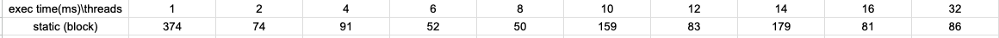
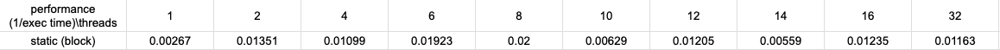

# 2023 - Spring, Multi Core Computing Assignment1
Make a multi-thread java application and analyze the performance.

## Requirements
1. 2 subdirectories. problem1 and problem2 under proj1
2. Java source code, Parallel performance report, video file for compilation and execution under each problem dir.
3. Contents required in the reports
   1. CPU Type, Number of cores, Memory Size, OS Type...
   2. Tables and Graphs showing execution time(ms) for each threads(1,2,4,6,8,10,12,14,16,32)
   3. Explanation and Analysis of the results with sufficient details.
   4. Entire Java source code and screen capture image of program execution and output.
   5. Guide for compilation and execution.
      *Please use CPU with more than 4 cores.


## Environment
### CPU Type
Apple M1 Pro(No Hyper Threading)
### Number of cores
8(6 for Performance, 2 for Efficiency)
### Memory Size
16GB
### OS Type
mac os Ventura 13.3.1

## Tables and Graphs
### Execution Time for each threads
#### Table

#### Graph
.png)
### Performance for each threads
#### Table

#### Graph
_performance.png)

## Explanation and Analysis of the results
I used block decomposition approach for load balancing matrix multiplication.

1. Block Decomposition
   Divide the numbers from 1 to 199999 into number of block according to the number of threads.  
   For instance, if I have to use 4 threads, then divide the whole matrix into 4 blocks sequentially from top to bottom.  
   It means that from 0th row to nth row(the last), the blocks composed of multiple rows which are partition of whole matrix
   are assigned to each worker(thread). Then each worker performs matrix multiplication.

This is an example with 5x5 matrix.
> 0 0 0 0 0 <- block 1 start  
> 0 0 0 0 0  
> 0 0 0 0 0 <- block 1 end  
> 0 0 0 0 0 <- block 2 start  
> 0 0 0 0 0 <- block 2 end  

The Performance(1/execution time(ms)) is increase rapidly when the number of thread is small.
The performance has peak when 8 threads are used(same as the number of cores).
Then it gets down for 10 threads, then gets high again for 12 threads.
Then it gets high again for 16 threads, then gets little down for 32 threads(maximum).

The reasonable analysis for this phenomenon seems that subtasks are assigned to workers well until 8 threads(same as 
cores) but in the case of using more threads than cores, assigning such a heavy task(matrix multiplication) to threads
results in having more computing overhead when using cores more than the computer system's maximum cores. 
As the cores are heterogeneous(6 for performance, 2 for efficiency), there would be challenges to utilize cores for performance.
Trying to assign tasks to threads more than cores can lead to low performance because of managing processors such as scheduling, 
context switching, job prioritizing.  

In conclusion,
We can see the tendency of increasing performance by the number of thread increasing until the number of threads under
the number of cores, but there were also differences and challenges by approaches.    
I learned that for the case of assigning heavy tasks(like matrix multiplication), should be careful of using proper
load balancing strategies along with efficient algorithms including understand of thread management strategies.  

## Source Code
### Block Decomposition for Matrix Multiplication
```java
import java.util.*;
import java.lang.*;

// command-line execution example) java MatmultD 6 < mat500.txt
// 6 means the number of threads to use
// < mat500.txt means the file that contains two matrices is given as standard input
//
// In eclipse, set the argument value and file input by using the menu [Run]->[Run Configurations]->{[Arguments], [Common->Input File]}.

// Original JAVA source code: http://stackoverflow.com/questions/21547462/how-to-multiply-2-dimensional-arrays-matrix-multiplication
public class MatmultD
{
    private static Scanner sc = new Scanner(System.in);
    public static void main(String [] args)
    {
        int thread_no=0;
        if (args.length==1) thread_no = Integer.valueOf(args[0]);
        else thread_no = 1;

        int a[][]=readMatrix();
        int b[][]=readMatrix();
        // We use static load balancing approach with multi-threads 2,4,6...32
        int[][] c;
        long startTime = System.currentTimeMillis();
        if (thread_no == 1) {
            c = multMatrix(a,b);
        }
        else {
            c = multiplyMatrixInParallel(a,b, thread_no);
        }
        long endTime = System.currentTimeMillis();

        //printMatrix(a);
        //printMatrix(b);
        printMatrix(c);

        //System.out.printf("thread_no: %d\n" , thread_no);
        //System.out.printf("Calculation Time: %d ms\n" , endTime-startTime);

        System.out.printf("[thread_no]:%2d , [Time]:%4d ms\n", thread_no, endTime-startTime);
    }

    public static int[][] readMatrix() {
        int rows = sc.nextInt();
        int cols = sc.nextInt();
        int[][] result = new int[rows][cols];
        for (int i = 0; i < rows; i++) {
            for (int j = 0; j < cols; j++) {
                result[i][j] = sc.nextInt();
            }
        }
        return result;
    }

    public static void printMatrix(int[][] mat) {
        System.out.println("Matrix["+mat.length+"]["+mat[0].length+"]");
        int rows = mat.length;
        int columns = mat[0].length;
        int sum = 0;
        for (int i = 0; i < rows; i++) {
            for (int j = 0; j < columns; j++) {
                System.out.printf("%4d " , mat[i][j]);
                sum+=mat[i][j];
            }
            System.out.println();
        }
        System.out.println();
        System.out.println("Matrix Sum = " + sum + "\n");
    }

    private static int[][] multiplyMatrixInParallel(int a[][], int b[][], int threads) {
        // We use divide and conquer approach for this multiplication.
        // Decompose the matrix into number of threads.
        // For example, 4x4 -> 1x4 with 4 threads.
        final int aRows = a.length;
        final int aCols = a[0].length;
        final int[][] resultMatrix = new int[aRows][aCols];
        Thread[] workers = new Thread[threads];
        int rowStart = 0; int rowEnd;
        final int rowStride = Math.floorDiv(aRows,threads);
       
        int wid = 0;
        for (int i=0;i<threads;i++) {
            rowStart = i * rowStride;
            rowEnd = (i != threads-1) ? rowStart + rowStride : aRows;
            workers[wid] = new MatMultWorker(wid, a, b, resultMatrix, aCols, rowStart, rowEnd, 0, aCols);
            workers[wid].start();
            wid++;
        }
        try {
            for (Thread worker : workers) {
                worker.join();
            }
        } catch (InterruptedException e) {}
        return resultMatrix;
    }

    public static int[][] multMatrix(int a[][], int b[][]){//a[m][n], b[n][p]
        if(a.length == 0) return new int[0][0];
        if(a[0].length != b.length) return null; //invalid dims

        int n = a[0].length;
        int m = a.length;
        int p = b[0].length;
        int ans[][] = new int[m][p];

        for(int i = 0;i < m;i++){
            for(int j = 0;j < p;j++){
                for(int k = 0;k < n;k++){
                    ans[i][j] += a[i][k] * b[k][j];
                }
            }
        }
        return ans;
    }
}

public class MatMultWorker extends Thread {
    final int wid;
    final int[][] a; final int[][] b; final int[][] resultMatrix;
    final int aCols; final int rowStart; final int rowEnd;
    final int colStart; final int colEnd;
    public MatMultWorker(int wid, int[][] a, int[][] b, int[][] resultMatrix, int aCols, int rowStart, int rowEnd, int colStart, int colEnd) {
        super("wid "+wid);
        this.wid = wid;
        this.a = a;
        this.b = b;
        this.aCols = aCols;
        this.resultMatrix = resultMatrix;
        this.rowStart = rowStart;
        this.rowEnd = rowEnd;
        this.colStart = colStart;
        this.colEnd = colEnd;
    }

    public void run() {
        System.out.println(getName()+" is working.");
        long startTime = System.currentTimeMillis();
        for (int i=rowStart;i<rowEnd;i++) {
            for (int j=colStart;j<colEnd;j++) {
                for (int k=0;k<aCols;k++) {
                    resultMatrix[i][j] += a[i][k] * b[k][j];
                }
            }
        }
        long endTime = System.currentTimeMillis();
        System.out.println(getName()+" is done.");
        String execTimeMsg = "Execution time of " + getName() + " is " + (endTime - startTime);
        System.out.println(execTimeMsg);
    }
}

```

### Execution Image and Output


## Guide for Compilation and Execution
### Requirements for compilation and execution
- OS: macos(latest)  
  you can use other os of course, but please setup specific compilation, execution options by yourself.
- Processor: M1 Pro(processors can differ by each case of testing environments)
- Cores: 8(6 for performance, 2 for efficiency)
- IntelliJ IDEA 2023.1 (Ultimate Edition)
  Runtime version: 17.0.6+10-b829.5 aarch64
  VM: OpenJDK 64-Bit Server VM by JetBrains s.r.o.  
  you can use eclipse ide of course, but please setup eclipse by yourself.
- Compiler: Javac
- JDK: Java 17

### Steps to compilation and execution
1. Open problem2 directory with IntelliJ idea.
2. Open execution class file(MatmultD).
3. Find "Run" option on ide and Click "Edit Configurations" under "Run" option.
4. Add applications for main class.
   a. Set application name for execution.
   b. Set main class for execution.
   c. Set run configuration to "local machine".
   d. Set program arguments and environment variables.
5. Run execution class.
6. After execution, you can see the compiled java byte code files in subdirectory "out/production/problem2".

